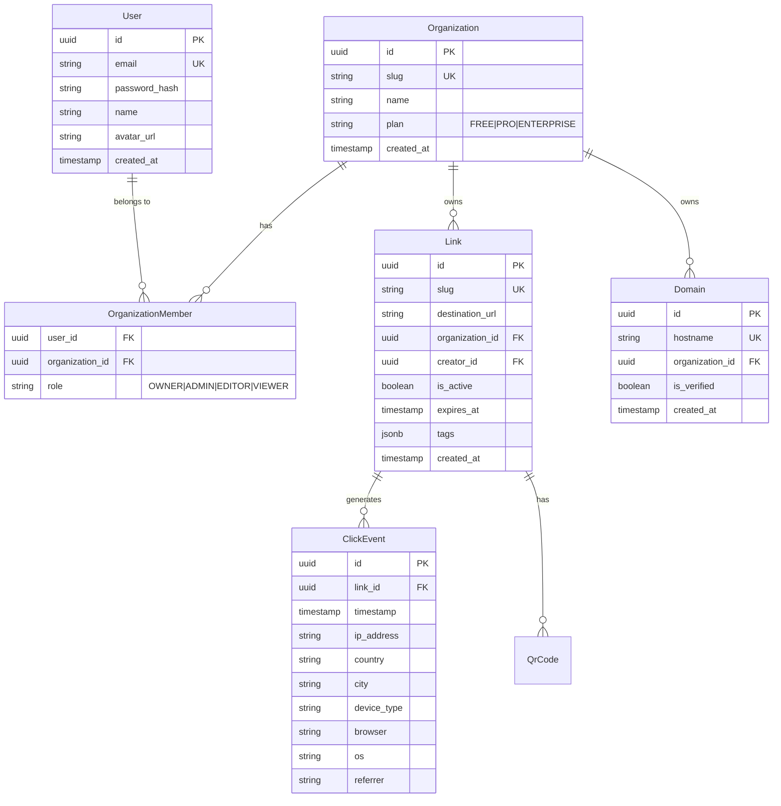

# Data Model: Core Platform

**Database**: PostgreSQL (Supabase)
**ORM**: Prisma

## Schema Overview



## Prisma Schema (Draft)

```prisma
model User {
  id        String   @id @default(dbgenerated("gen_random_uuid()")) @db.Uuid
  email     String   @unique
  name      String?
  avatarUrl String?
  createdAt DateTime @default(now())

  memberships OrganizationMember[]
}

model Organization {
  id        String   @id @default(dbgenerated("gen_random_uuid()")) @db.Uuid
  slug      String   @unique
  name      String
  plan      PlanType @default(FREE)
  createdAt DateTime @default(now())

  members   OrganizationMember[]
  links     Link[]
  domains   Domain[]
}

model OrganizationMember {
  userId         String       @db.Uuid
  organizationId String       @db.Uuid
  role           MemberRole   @default(VIEWER)

  user           User         @relation(fields: [userId], references: [id])
  organization   Organization @relation(fields: [organizationId], references: [id])

  @@id([userId, organizationId])
}

model Link {
  id             String    @id @default(dbgenerated("gen_random_uuid()")) @db.Uuid
  slug           String    @unique
  destinationUrl String
  organizationId String    @db.Uuid
  creatorId      String    @db.Uuid
  isActive       Boolean   @default(true)
  expiresAt      DateTime?
  tags           String[]
  createdAt      DateTime  @default(now())

  organization   Organization @relation(fields: [organizationId], references: [id])
  clicks         ClickEvent[]
}

model ClickEvent {
  id        String   @id @default(dbgenerated("gen_random_uuid()")) @db.Uuid
  linkId    String   @db.Uuid
  timestamp DateTime @default(now())
  ip        String?
  country   String?
  city      String?
  device    String?
  browser   String?
  os        String?
  referrer  String?

  link      Link     @relation(fields: [linkId], references: [id])
}

enum MemberRole {
  OWNER
  ADMIN
  EDITOR
  VIEWER
}

enum PlanType {
  FREE
  PRO
  ENTERPRISE
}
```
