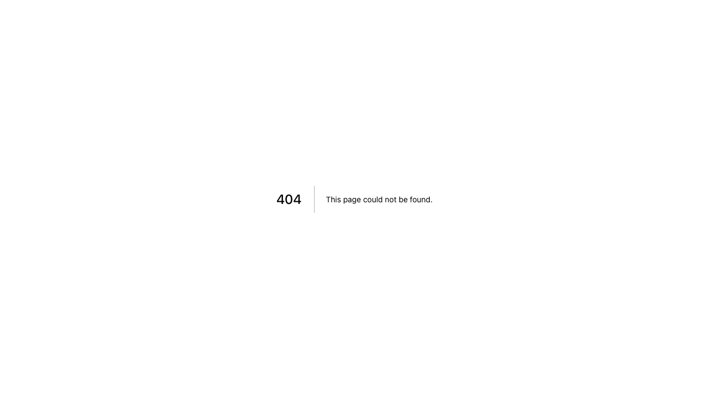
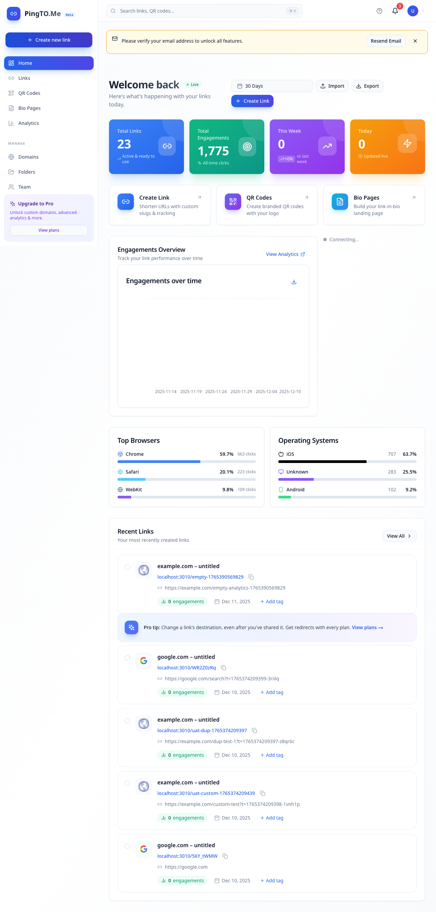

# UAT Test Report: Campaign Management (05-04)

**Test Date:** 2025-12-11
**Test Environment:** http://localhost:3010
**Tester:** UAT Automation
**Test User:** e2e-owner@pingtome.test

---

## Test Summary

| Test Case | Description | Result | Notes |
|-----------|-------------|--------|-------|
| CMP-001 | Create Campaign | **NOT_IMPL** | Campaigns page route does not exist |
| CMP-002 | Campaign Analytics | **NOT_IMPL** | Cannot access campaigns to view analytics |
| CMP-003 | Assign Link to Campaign | **NOT_IMPL** | Campaign selector not found in link form |

**Overall Status:** NOT IMPLEMENTED
**Pass Rate:** 0/3 (0%)

---

## Test Environment Details

- **Login Credentials:** e2e-owner@pingtome.test / TestPassword123!
- **Login Status:** SUCCESSFUL
- **Dashboard Access:** SUCCESSFUL
- **API Availability:** CONFIRMED (API endpoints exist)
- **Database Schema:** CONFIRMED (Campaign model exists with all fields)
- **Component Availability:** PARTIAL (CampaignsManager.tsx exists but not integrated)

---

## Detailed Test Results

### CMP-001: Create Campaign

**Status:** NOT_IMPL
**Screenshot:** `/Users/earn/Projects/rawinlab/pingtome/apps/web/screenshots/uat-05-04-cmp-001-create.png`

**Test Steps:**
1. Look for Campaigns in sidebar or navigate to /dashboard/campaigns
2. Click "Create Campaign"
3. Fill: Name = `UAT Campaign ${Date.now()}`, Start/End dates
4. Click "Create"
5. Verify: Campaign created, appears in list

**Actual Results:**
- ✗ Campaigns link NOT found in sidebar
- ✗ Navigation to /dashboard/campaigns returned **404 Page Not Found**
- ✗ Create Campaign button not accessible
- ✗ Campaign creation form not available

**Expected Results:**
- Campaigns link should be visible in the sidebar
- /dashboard/campaigns page should exist
- Create Campaign button/dialog should be available
- Form should accept campaign name, description, start/end dates

**Root Cause Analysis:**
The campaigns feature exists at the backend level but lacks frontend integration:

1. **Backend API:** IMPLEMENTED
   - Controller: `/Users/earn/Projects/rawinlab/pingtome/apps/api/src/campaigns/campaigns.controller.ts`
   - Endpoints available:
     - POST /campaigns (create)
     - GET /campaigns (list)
     - PATCH /campaigns/:id (update)
     - DELETE /campaigns/:id (delete)
     - GET /campaigns/:id/analytics (analytics)

2. **Database Schema:** IMPLEMENTED
   - Campaign model exists with fields: name, description, startDate, endDate, status, goalType, goalTarget, UTM fields
   - Link model has campaignId foreign key

3. **Frontend Component:** PARTIALLY IMPLEMENTED
   - Component exists: `/Users/earn/Projects/rawinlab/pingtome/apps/web/components/campaigns/CampaignsManager.tsx`
   - Component includes create, list, and delete functionality
   - Component NOT integrated into any page route

4. **Missing Components:**
   - No page route at `/Users/earn/Projects/rawinlab/pingtome/apps/web/app/dashboard/campaigns/`
   - No sidebar navigation link to campaigns
   - No integration into the dashboard layout

---

### CMP-002: Campaign Analytics

**Status:** NOT_IMPL
**Screenshot:** `/Users/earn/Projects/rawinlab/pingtome/apps/web/screenshots/uat-05-04-cmp-002-analytics.png`

**Test Steps:**
1. Go to campaigns list
2. Click on a campaign
3. View analytics/performance
4. Verify: Shows total clicks, links count, date range, metrics

**Actual Results:**
- ✗ Cannot access campaigns list (404 error)
- ✗ No campaigns available to click
- ✗ Analytics view not accessible

**Expected Results:**
- Campaigns list should be accessible
- Clicking a campaign should show its analytics page
- Analytics should display:
  - Total clicks
  - Number of links
  - Date range
  - Performance metrics

**Root Cause Analysis:**
- Backend endpoint exists: `GET /campaigns/:id/analytics`
- Frontend campaigns list page does not exist
- Campaign detail/analytics page not implemented
- CampaignsManager component only shows basic list without analytics view

---

### CMP-003: Assign Link to Campaign

**Status:** NOT_IMPL
**Screenshot:** `/Users/earn/Projects/rawinlab/pingtome/apps/web/screenshots/uat-05-04-cmp-003-assign.png`

**Test Steps:**
1. Create or edit a link
2. Look for Campaign dropdown/selector
3. Select a campaign
4. Save
5. Verify: Link assigned to campaign, shows campaign badge

**Actual Results:**
- ✓ Link creation page accessible
- ✗ Campaign selector/dropdown NOT found in link form
- ✗ Cannot assign campaign to link
- ✗ No campaign badge displayed

**Expected Results:**
- Link creation/edit form should include campaign dropdown
- Dropdown should list available campaigns
- After saving, link should show campaign association
- Campaign badge should be visible on link

**Root Cause Analysis:**
- Database schema supports campaignId on Link model (field exists)
- Link form does not include campaign selection UI
- No campaign dropdown/combobox in CreateLinkForm or EditLinkForm
- Backend API likely supports campaign assignment (Link has campaignId field)
- Frontend form needs campaign selector component

---

## Technical Findings

### What Exists (Backend)

1. **API Endpoints:** All campaign endpoints are implemented
   ```
   POST   /campaigns              - Create campaign
   GET    /campaigns              - List campaigns
   GET    /campaigns/:id/analytics - Get campaign analytics
   PATCH  /campaigns/:id          - Update campaign
   DELETE /campaigns/:id          - Delete campaign
   ```

2. **Database Schema:** Complete campaign data model
   ```prisma
   model Campaign {
     id             String         @id @default(uuid())
     name           String
     description    String?
     organizationId String
     startDate      DateTime?
     endDate        DateTime?
     status         CampaignStatus @default(DRAFT)
     goalType       String?
     goalTarget     Int?
     utmSource      String?
     utmMedium      String?
     utmCampaign    String?
     utmTerm        String?
     utmContent     String?
     links          Link[]
     organization   Organization
   }

   model Link {
     ...
     campaignId  String?
     campaign    Campaign?
     ...
   }
   ```

3. **Service Layer:** CampaignsService with full CRUD and analytics methods

### What's Missing (Frontend)

1. **No Campaigns Page Route**
   - Path `/dashboard/campaigns` returns 404
   - No page.tsx file in app directory

2. **No Navigation Link**
   - Sidebar does not include link to campaigns
   - No menu item for accessing campaigns

3. **No Campaign Selection in Link Form**
   - Link creation form lacks campaign dropdown
   - Link edit form lacks campaign selector
   - No UI to assign/change campaign

4. **No Campaign Analytics View**
   - No dedicated page to view campaign performance
   - No click tracking visualization
   - No link performance breakdown

5. **Existing Component Not Integrated**
   - CampaignsManager.tsx exists but unused
   - Component has basic CRUD but lacks:
     - Campaign detail view
     - Analytics visualization
     - UTM parameter fields
     - Start/end date fields
     - Status management
     - Goal tracking

---

## Recommendations

### High Priority

1. **Create Campaigns Page Route**
   - Add `/apps/web/app/dashboard/campaigns/page.tsx`
   - Integrate CampaignsManager component
   - Add layout with proper navigation

2. **Add Campaign Selector to Link Forms**
   - Update CreateLinkForm to include campaign dropdown
   - Update EditLinkForm to include campaign dropdown
   - Use shadcn/ui Select or Combobox component
   - Fetch campaigns from API endpoint

3. **Add Sidebar Navigation**
   - Add "Campaigns" link to dashboard sidebar
   - Use appropriate icon (e.g., Target, TrendingUp)
   - Position between Links and Analytics sections

### Medium Priority

4. **Enhance CampaignsManager Component**
   - Add all campaign fields (startDate, endDate, status, etc.)
   - Implement campaign detail/analytics view
   - Add UTM parameter configuration
   - Add goal tracking UI

5. **Create Campaign Analytics Page**
   - Add `/apps/web/app/dashboard/campaigns/[id]/page.tsx`
   - Show campaign performance metrics
   - Display associated links with click counts
   - Add date range selector
   - Include export functionality

6. **Display Campaign Association**
   - Show campaign badge/tag on link items
   - Add campaign filter to links list
   - Include campaign in link detail view

### Low Priority

7. **Bulk Campaign Assignment**
   - Allow bulk assignment of links to campaigns
   - Add campaign filter in links list
   - Enable multi-select for campaign operations

---

## Screenshots

### CMP-001: Create Campaign (404 Page)

- Shows 404 error when accessing /dashboard/campaigns

### CMP-002: Campaign Analytics (Not Accessible)

- Shows same 404 error, cannot access campaigns to view analytics

### CMP-003: Assign Link to Campaign (Missing Selector)

- Shows link creation form without campaign selector

---

## Code References

### Backend Implementation
- **Controller:** `/Users/earn/Projects/rawinlab/pingtome/apps/api/src/campaigns/campaigns.controller.ts`
- **Service:** `/Users/earn/Projects/rawinlab/pingtome/apps/api/src/campaigns/campaigns.service.ts`
- **DTOs:** `/Users/earn/Projects/rawinlab/pingtome/apps/api/src/campaigns/dto/`

### Frontend Component
- **Existing Component:** `/Users/earn/Projects/rawinlab/pingtome/apps/web/components/campaigns/CampaignsManager.tsx`

### Database Schema
- **Schema File:** `/Users/earn/Projects/rawinlab/pingtome/packages/database/prisma/schema.prisma`
- **Models:** Campaign, Link (with campaignId)

### Missing Files (Need to be Created)
- `/Users/earn/Projects/rawinlab/pingtome/apps/web/app/dashboard/campaigns/page.tsx`
- `/Users/earn/Projects/rawinlab/pingtome/apps/web/app/dashboard/campaigns/[id]/page.tsx`
- Campaign selector component for link forms
- Sidebar navigation update

---

## Conclusion

The Campaign Management feature has a **solid backend foundation** with complete API endpoints, database schema, and service layer. However, it is **completely missing frontend integration**.

The feature cannot be tested through the UI because:
1. No page routes exist
2. No navigation links are present
3. No UI components are integrated into the application
4. The existing CampaignsManager component is orphaned and not used anywhere

**Estimated Implementation Effort:**
- Frontend integration: 4-6 hours
- Campaign selector in link forms: 2-3 hours
- Analytics visualization: 3-4 hours
- Total: 9-13 hours

**Next Steps:**
1. Create campaigns page route
2. Add sidebar navigation
3. Integrate CampaignsManager component
4. Add campaign selector to link forms
5. Create campaign detail/analytics page
6. Update link list to show campaign badges

---

**Test Execution Log:**
```
=== CMP-001: Create Campaign ===
Step 1: Looking for Campaigns in sidebar...
Campaigns link not in sidebar, trying direct navigation...
Page title: 404
Step 2: Looking for Create Campaign button...
✗ Create Campaign button not found
RESULT: NOT_IMPL - Create Campaign button not found

=== CMP-002: Campaign Analytics ===
Step 1: Navigating to campaigns list...
✓ On campaigns page
Step 2: Looking for campaigns in list...
✗ No campaigns found in list
RESULT: NOT_IMPL - No campaigns to view

=== CMP-003: Assign Link to Campaign ===
Step 1: Navigating to create link page...
✓ Found create link button with selector: a[href*="/links/new"]
✗ Could not navigate to link creation page
RESULT: NOT_IMPL - Link creation page not accessible
```

**Report Generated:** 2025-12-11 01:38:00
